# Department app

Department app is a web application which uses a RESTful web service to manage
information about departments and their employees.

Application should provide:

- Storing information about departments and employees in a database.
- Display the list of departments, and the average salary
  (calculated automatically) for each department.
- Change the list of departments (add, edit or delete a department).
- Display the list of all employees.
- Change the list of employees (add, edit or delete an employee).
- Display employees of a particular department with possibility to add, edit or delete one.
- Search employees born on a certain date or in a date range both among all listed employees
or in a particular department.
  
## 1. Departments
### 1.1 Display the list of departments

*Main scenario:*

- User enters the site, or clicks the "Departments" link in the navbar.
- Application displays a table with information about departments.
- Above the table a form is displayed, where the user can add new department.

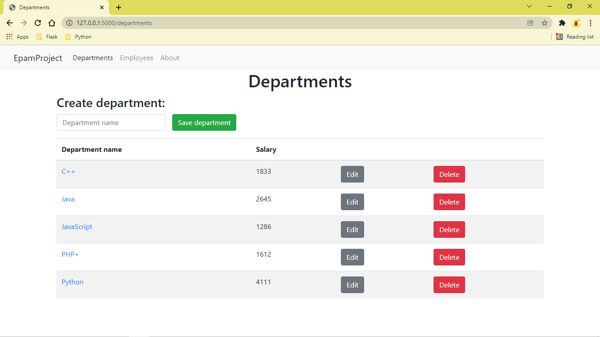
Pic 1.1 departments_list

The table contains the following columns:

- Name, the unique name of the department, that is a link to the corresponding department
  detail page.
- Average salary, the average salary of the department, calculated by summing the salaries
  of employees in the department and dividing the sum by the count of employees. Zero if
  the department has no employees.
- "Edit" button, that triggers the department edition scenario.
- "Delete" button, that triggers the department deletion scenario.

*When no departments to display scenario:*

- User enters the site, or clicks the "Departments" link in the navbar.

- Application displays a form, where the user can add departments.

- Instead of the table the text "No departments found." is displayed.

### 1.2 Add department
*Main scenario:*

- User enters department name in the form located above the departments table or
  above the "There are no departments yet" text and presses the "Save department" button.
- If form validation fails - under the form field with invalid data an
  error message is displayed.
- If any other error occurs, an error message is displayed above the form.
- If everything passes, a new department entry is added to the database, the application
  redirects to the department list page, and a success message is displayed above the form.
 
*Cancel operation scenario:*
 
- User enters department name and after that clicks any link on the page
  (except the "Save department" button) or refreshes the page.
- The department is not saved to the database, and the corresponding page 
is displayed, or action is performed.

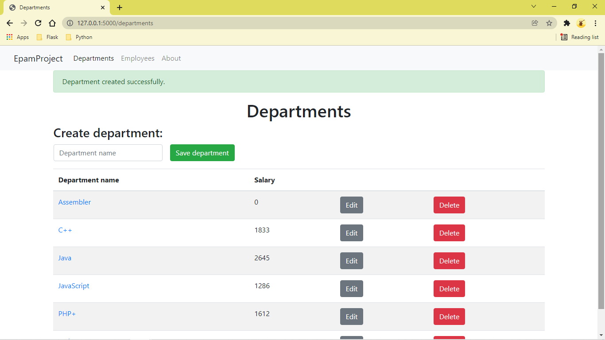
Pic. 1.2 Add department success.

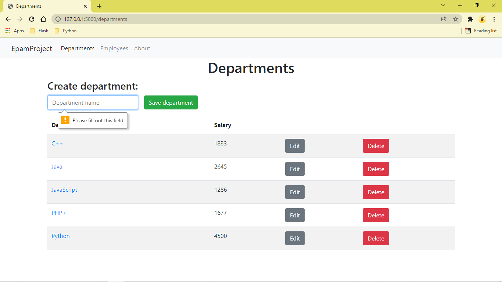
Pic. 1.3 Add department validation error.

For successfully adding a department the data must conform these requirements:

- The name of the department must be 3 to 128 characters long.
- The names of the departments must be unique.

### 1.3 Edit department

*Main scenario:*

- User clicks the "Edit" button on departments page
- Application renders the department list page, but instead of "Create department:"
 there will be "Edit selected department". Below it will be the form above the table if filled
  with the data of the department to be edited.
- User changes the department data and presses the "Save department" button.
- If form validation fails - under the form field with invalid data an
  error message is displayed.
- If any other error occurs, an error message is displayed above the form.
- If everything passes, the department entry is updated in the database, the
  application redirects to the department list page, and a success message is
  displayed above the form.
 
*Cancel operation scenario:*

- User clicks the "Edit" button on departments page
- Application renders the form above the table with the data of the department
  to be edited.
- User changes the department data and clicks any link on the page
  (except the "Save department" button).
- The department is not updated in the database, and the corresponding page 
is displayed or action is performed.

Pic. 1.4 Edit department in progress.

Pic. 1.5 Edit department success.

For successfully editing a department the data must conform these requirements:
- The name of the department must be 3 to 128 characters long.
- The names of the departments must be unique.

### 1.4 Delete department

*Main scenario:*

- User clicks the "Delete" button on departments page
- A confirmation dialog window is displayed.
- User clicks "Ok"  
- The department is deleted from the database
- The updated list of departments with a success message is displayed.

*Cancel operation scenario:*

- User clicks the "Delete" button on departments page
- A confirmation dialog window is displayed.
- User clicks "Cancel"
- Deletion doesn't happen.

Pic. 1.6 Delete department confirmation

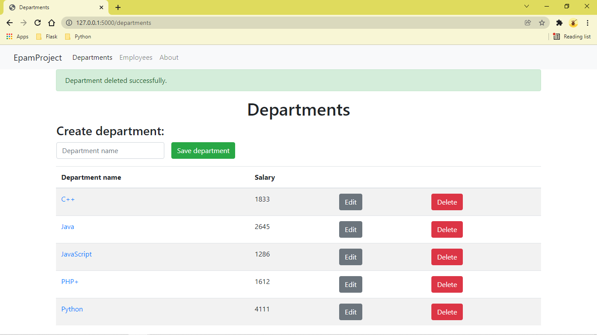
Pic. 1.7 Delete department success.

## 2. Department Detail

### 2.1 Display the list of employees for department
*Main scenario:*

- User clicks the department name link on the departments details page.
- Application displays a table with information about employees in particular department
- Above the table a form is displayed, where the user can add an employee to the department.

Pic 2.1 The department details page

The table contains the following columns:

- Full name: the full name of the employee.
- Date of birth: the employee's date of birth
- Salary: the employee's salary

*'No employees in department' scenario:*

- User clicks the department name link on the departments or employees page
- Application displays a form, where the user can add an employee to the department.
- Instead of the table the text "No employees found." is displayed

### 2.2 Add employee to department
*Main scenario:*

- User enters employee data in the form located above the employees table or
  above the "No employees found" text and presses the "Save employee" button.
- If form validation fails - under the form field with invalid data an
  error message is displayed.
- If any other error occurs, an error message is displayed above the form.
- If everything passes, a new employee entry is added to the database with department
  data of the department detailed on the page, the application redirects to the
  department detail page, and a success message is displayed above the form.
 
*Cancel operation scenario:*
 
- User enters employee data and after that clicks any link on the page
  (except the "Save employee" button) or refreshes the page.
- The employee is not saved to the database, and the corresponding page 
is displayed, or action is performed.

Pic. 2.2 Add employee to department success.

For successfully adding an employee the data must conform these requirements:

- The full name of the employee must be 6 to 128 characters long.
- The date of birth of the employee have to be picked from the date input.
- The salary of the employee must be a positive integer  
- Full name of employee cannot contain numbers and special symbols.

### 2.3 Edit employee from department detail page.
*Main scenario:*

- User clicks the "Edit" button on department details page
- Application renders the department details page, but instead of "Create new employee"
 there will be "Edit selected employee". Below it will be the form above the table if filled
  with the data of the selected emplooyee to be edited.
- User changes the employee data and presses the "Save" button.
- If form validation fails - under the form field with invalid data an
  error message is displayed.
- If any other error occurs, an error message is displayed above the form.
- If everything passes, the employee entry is updated in the database, the
  application redirects to the department details page, and a success message is
  displayed above the form.
 
*Cancel operation scenario:*

- User clicks the "Edit" button on departments details page
- Application renders the form above the table with the data of the employees
  to be edited.
- User changes the employee's data and clicks any link on the page
  (except the "Save" button).
- The employee is not updated in the database, and the corresponding page 
is displayed or action is performed.
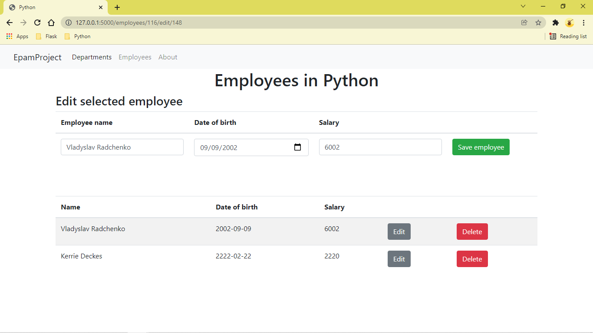
Pic. 2.3 Edit employee from department page.

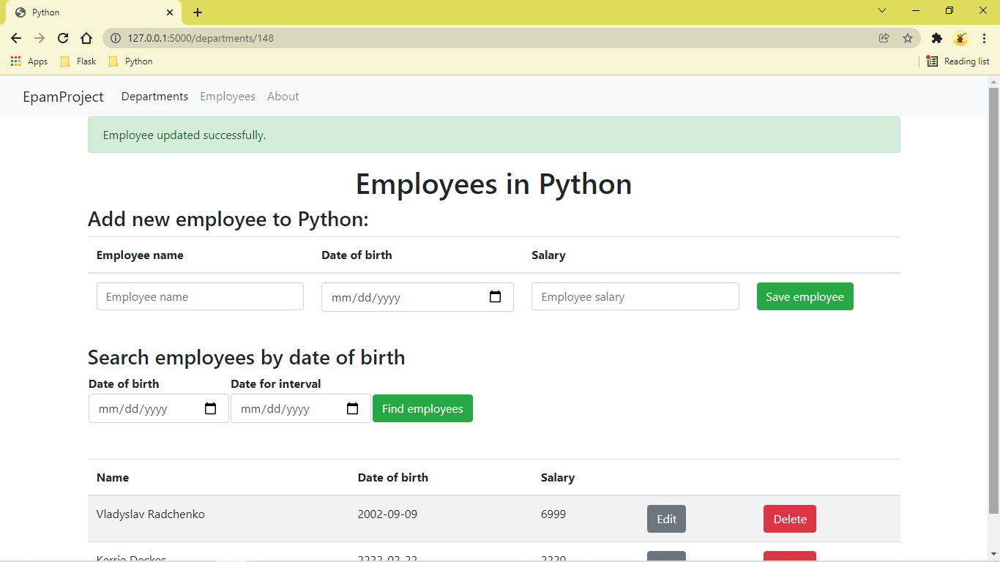
Pic. 2.4 Edit employee from department success.

For successfully adding an employee the data must conform these requirements:

- The full name of the employee must be 6 to 128 characters long.
- The date of birth of the employee have to be picked from the date input.
- The salary of the employee must be a positive integer  
- Full name of employee cannot contain numbers and special symbols.

### 2.4 Delete an employee from department details page.

*Main scenario:*

- User clicks the "Delete" button on department details page
- A confirmation dialog window is displayed.
- User clicks "Ok"  
- The employee is deleted from the database
- The updated list of department employees with a success message is displayed.

*Cancel operation scenario:*

- User clicks the "Delete" button on department details page
- A confirmation dialog window is displayed.
- User clicks "Cancel"
- Deletion doesn't happen.

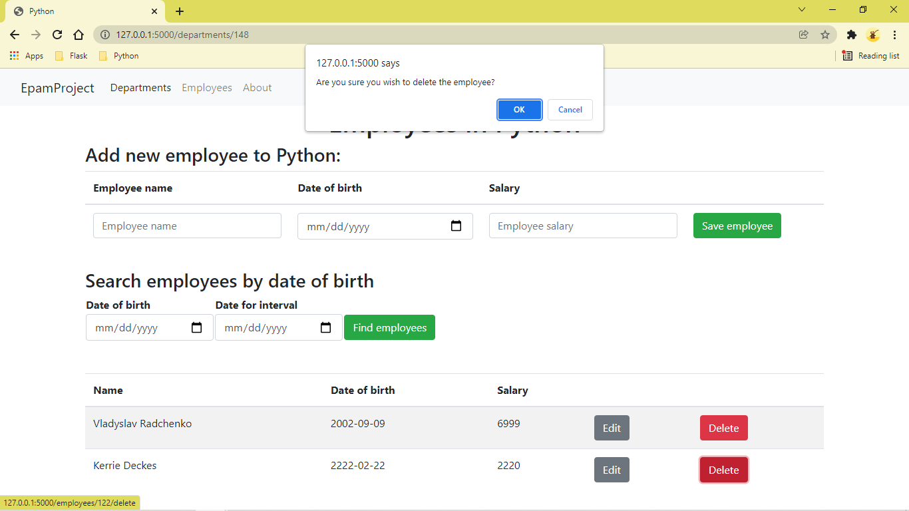
Pic. 2.5 Delete employee from department confirmation.

Pic. 2.6 Delete employee from department success.

### 2.5 Search employees by date of birth in department.
*Main scenario:*

- User enters the department details page;
- Application displays fields for entering start and end dates of birth;
- User enters data and presses the "Find emplooyees" button, all fields must be filled;
- Application displays all employees born in a specific date or between mentioned dates.

The form contains following fields:
- Date of birth;
- Date for interval.

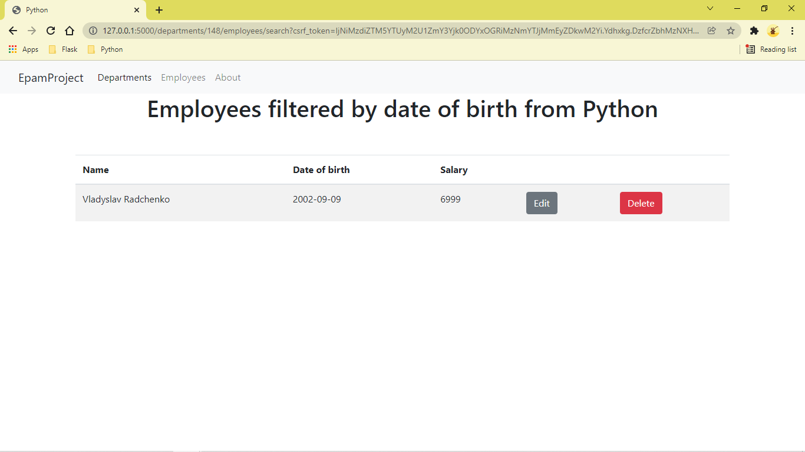
Pic. 2.5 Search employee from department by date of birth.

Pic. 2.6 Search employee from department by interval of date of birth.

## 3. Employees
### 3.1 Display the list of employees

*Main scenario:*

- User clicks the "Employees" link in the menu
- Application displays a table with information about employees.
- Above the table a form is displayed, where the user can add employees.

Pic 3.1 All employees page

The table contains the following columns:
- Full name: the full name of the employee.
- Date of birth: the employee's date of birth
- Salary: the employee's salary
- Department: the name of the department where the employee works.
  The department name is a link to the corresponding department
  detail page.

*'No employees in the database' scenario:*
- User clicks the "Employees" link in the menu
- Application displays a form, where the user can add employees.
- Instead of the table the text "No employees found." is displayed

### 3.2 Add employee
*Main scenario:*

- User enters employee data in the form located above the employees table or
  above the "No employees found" text and presses the "Save employee" button.
- If form validation fails - under the form field with invalid data an
  error message is displayed.
- If any other error occurs, an error message is displayed above the form.
- If everything passes, a new employee entry is added to the database, the application
  redirects to the employees page, and a success message is displayed above the form.
 
*Cancel operation scenario:*

- User enters employee data and after that clicks any link on the page
  (except the "Save employee" button) or refreshes the page.
- The employee is not saved to the database, and the corresponding page 
is displayed, or action is performed.
  
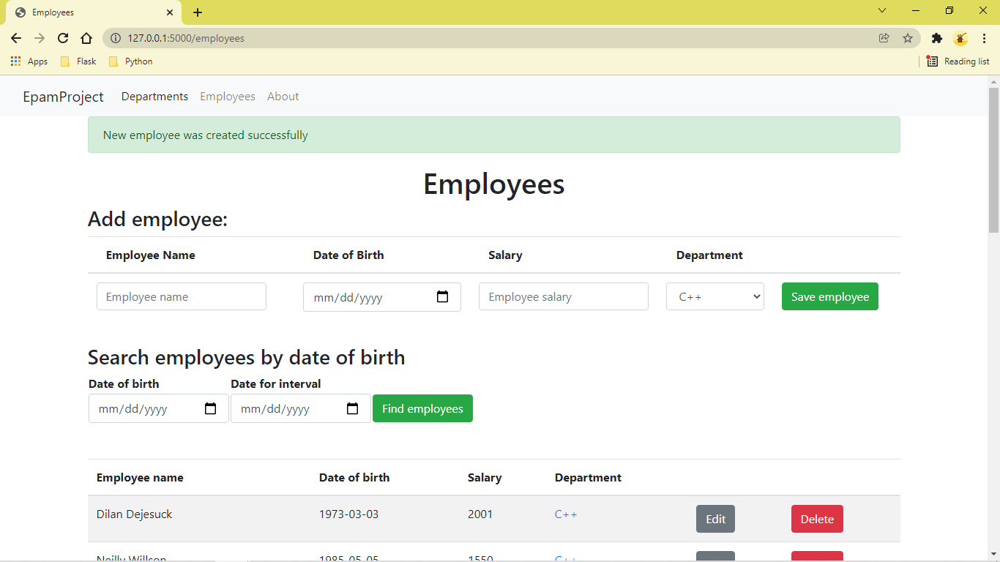
Pic. 3.2 Add employee success.

For successfully adding an employee the data must conform these requirements:

- The name of the employee must be 6 to 128 characters long.
- The date of birth of the employee have to be picked from the date input.
- The salary of the employee must be a positive integer  
- The department where the employee works have to be chosen from a select menu.
- Full name of employee cannot contain numbers and special symbols.

### 3.3 Edit employee
*Main scenario:*

- User clicks the "Edit" button on employees page page.
- Application renders the employees page, but instead of "Create new employee"
 there will be "Edit selected employee". Below it will be the form above the table if filled
  with the data of the selected emplooyee to be edited.
- User changes the employee data and presses the "Save employee" button.
- If form validation fails - under the form field with invalid data an
  error message is displayed.
- If any other error occurs, an error message is displayed above the form.
- If everything passes, the employee entry is updated in the database, the
  application redirects to the employees page or to department detail page 
  of the department of the employee (depends on where the "Edit" button was clicked),
  and a success message is displayed above the form.
 
 *Cancel operation scenario:*
 
- User clicks the "Edit" button on employees page or on department detail page.
- Application renders the employees page, but the form above the table if filled
  with the data of the employee to be edited.
- User changes the employee data and clicks any link on the page
  (except the "Save employee" button).
- The employee is not updated in the database, and the corresponding page 
is displayed or action is performed.

Pic. 3.3 Edit employee in progress.

Pic. 3.4 Edit employee success.

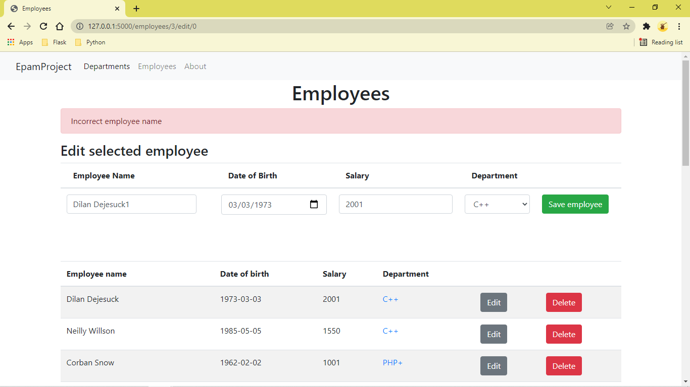
Pic. 3.5 Edit employee validation error.

For successfully editing an employee the data must conform these requirements:
- The name of the employee must be 4 to 100 characters long.
- The date of birth of the employee have to be picked from the date input.
- The salary of the employee must be a positive integer  
- The department where the employee works have to be chosen from a select menu.
- Full name of employee cannot contain numbers and special symbols.

### 3.4 Delete employee

*Main scenario:*

- User clicks the "Delete" button on employees page or on department detail page.
- A confirmation dialog window is displayed.
- User clicks "Ok"  
- The employee is deleted from the database
- The updated page where the button was clicked is displayed with a success message.

 *Cancel operation scenario:*
 
- User clicks the "Delete" button on employees page or on department detail page.
- A confirmation dialog window is displayed.
- User clicks "Cancel"
- Deletion doesn't happen.

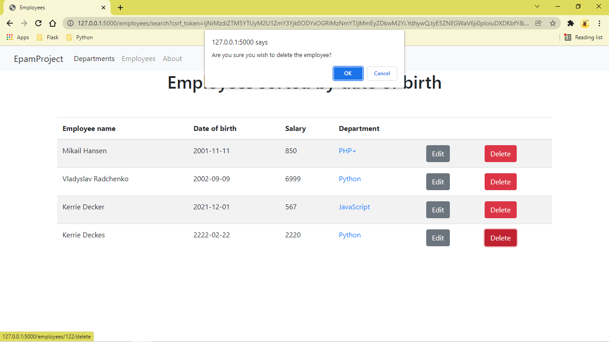
Pic. 3.4.1 Delete employee confirmation

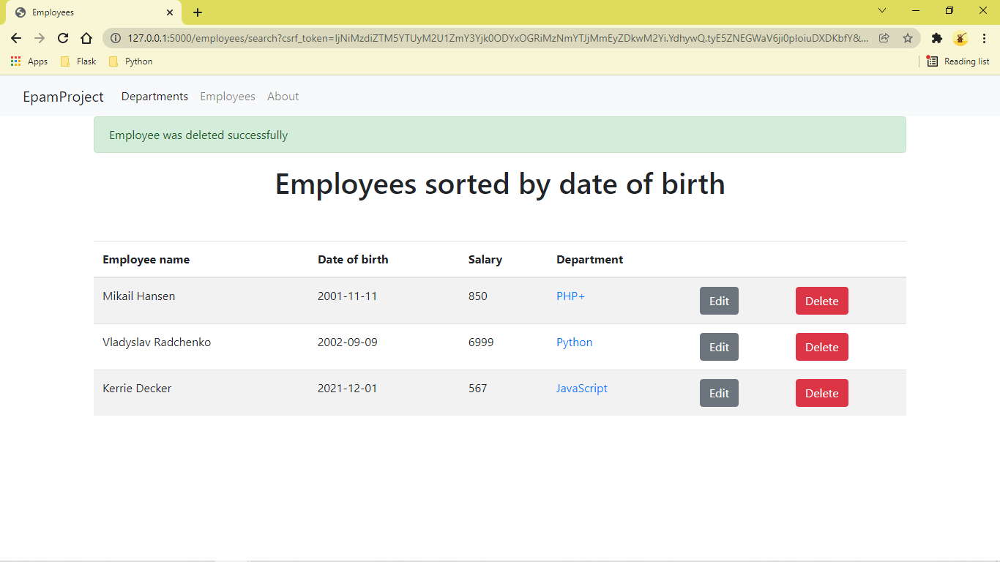
Pic. 3.4.2 Delete employee success.

### 3.5 Search employees by date of birth

*Search employees born on certain date scenario:*

- User opens the employees page or department detail page.
- User enters the date to search employees born on that
date to the "Date of birth" date input below the add/edit form.
- User clicks the "Find employees" button.
- Application updates the employee list with search results.

*Search employees born in an interval between dates scenario:*

- User opens the employees page or department detail page.
- User enters the lower point of the interval to the "Date of birth" date input,
  and the upper point to the "Date for interval" input below the add/edit form.
- User clicks the "Find employees" button.
- Application updates the employee list with search results.

Pic. 2.5 Search employees by date of birth.

Pic. 2.6 Search employees by interval of date of birth.